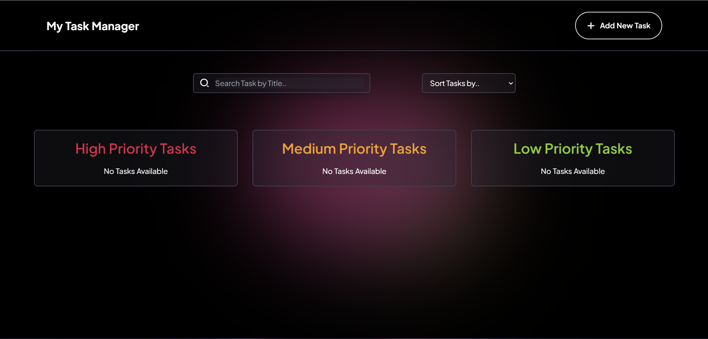
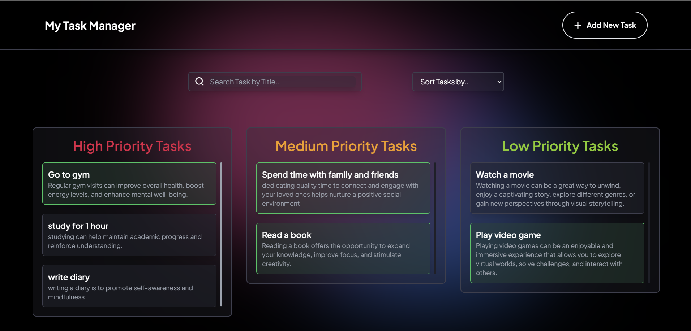
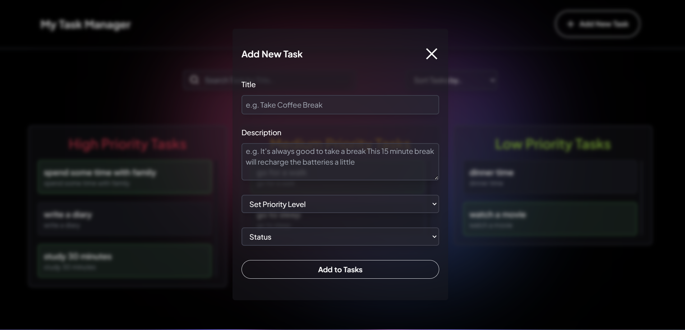
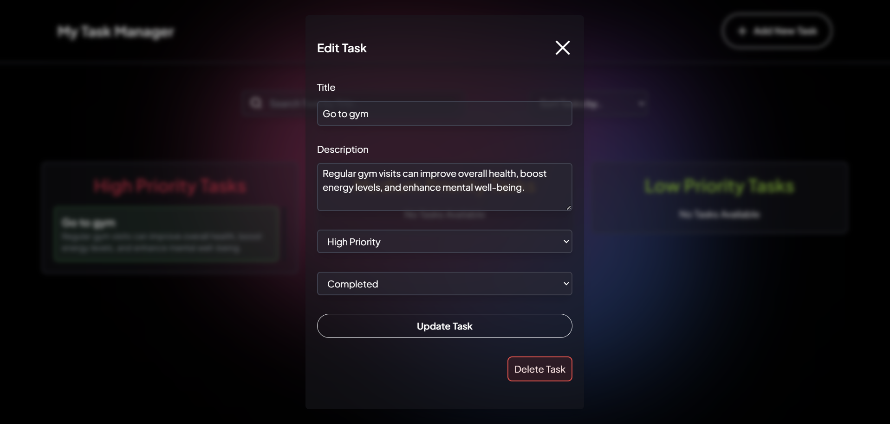
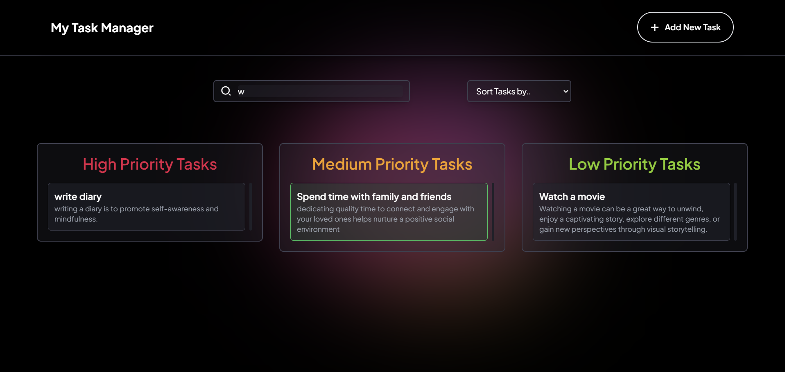
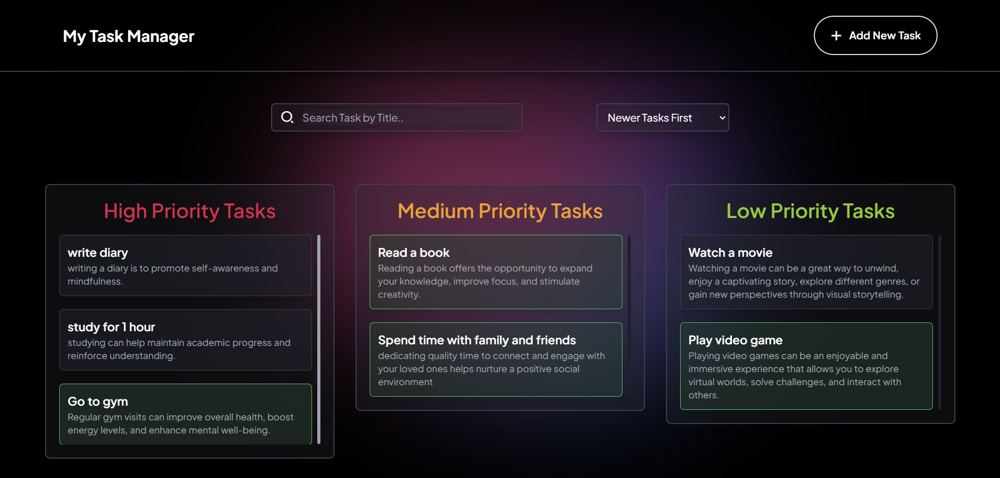
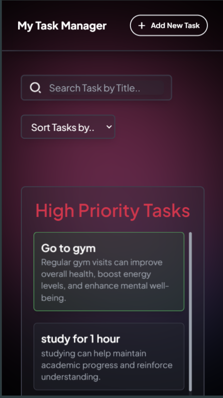

# Task Manager

## Overview
The **Task Manager** is a React-based web application designed to help users manage their tasks effectively. This application allows users to create, edit, delete, and categorize tasks based on their priority levels (High, Medium, Low). It includes functionality for searching and sorting tasks, and tasks are stored locally to maintain persistence across sessions.

## Features
- **Add New Task**: Create new tasks with details like title, description, priority, and status.
- **Edit Task**: Click on a task to pre-fill the form for easy updates.
- **Delete Task**: Remove tasks that are no longer needed.
- **Search**: Search tasks by title using the search bar.
- **Sort**: Sort tasks by completion status, task age (newer or older).
- **Categorization**: Separate task dashboards for High, Medium, and Low priority tasks.
- **Persistent Storage**: Utilizes `localStorage` to keep tasks stored across page reloads.

## Technology Stack
- **React**: Core framework for building the UI.
- **JavaScript**: Used for scripting logic.
- **CSS/Tailwind CSS**: Custom styling for a modern UI/UX.
- **UUID**: For generating unique task IDs.
- **Remix Icons**: For adding visually appealing icons.

## Components Breakdown
- **TaskManager**: Main component that holds the overall logic and state management.
- **Header**: Navigation bar with an 'Add New Task' button.
- **SearchTask**: Input field to filter tasks by title.
- **SortTasks**: Dropdown menu to sort tasks by status or age.
- **TasksDashboard**: Displays categorized tasks in separate sections.
- **TaskCard**: Represents individual tasks with an option to edit or delete.
- **AddTask**: Form component for adding or editing tasks.
- **BlurBg**: Provides a styled blurred background effect.

## Assumptions
During the development of the Task Manager, the following assumptions were made:
1. **Single User Scope**: The app is designed for single-user usage without authentication. All tasks are managed locally and not shared between users.
2. **Persistent Storage**: Tasks are stored in `localStorage`, meaning they will be cleared if the browser cache is cleared.
3. **Basic Task Structure**: Tasks include only a title, description, priority, and status. Additional fields like due dates, reminders, or attachments are out of scope.
4. **Immediate Form Reset**: When a new task is created, the form resets to be empty by default unless an existing task is clicked.
5. **Local Time Handling**: Task creation and editing timestamps use the local time zone of the user.
6. **Responsiveness**: The app is optimized for common screen sizes but may need additional tweaks for very small or very large displays.
7. **Non-Concurrent Task Editing**: The app doesn't handle simultaneous task edits by different tabs or browser instances.
8. **Unique Titles Not Required**: Tasks are allowed to have duplicate titles as they are differentiated by unique IDs.

## Setup and Launch Process

### Prerequisites
Ensure you have the following installed on your machine:
- **Node.js** (v14 or higher)
- **npm** (v6 or higher) or **yarn** as your package manager


### Homepage



### Add new Task Page


### Edit Task Page


### Search Task Page


### Sort Task Page


### Responsive Page



### Prerequisites
Ensure you have the following installed on your machine:
- **Node.js** (v14 or higher)
- **npm** (v6 or higher) or **yarn** as your package manager


### Installation and Setup
1. **Clone the repository**:
   Open your terminal and clone the project repository from GitHub:
   ```bash
   git clone https://github.com/sharvil31/Task-Manager.git
   cd Task-Manager
# Task-Manager
